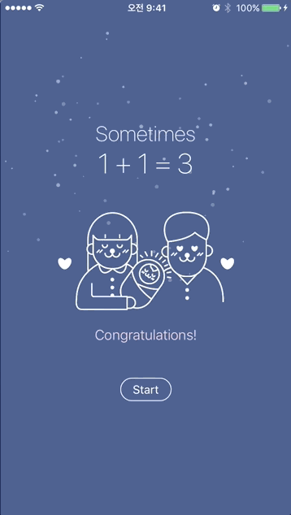
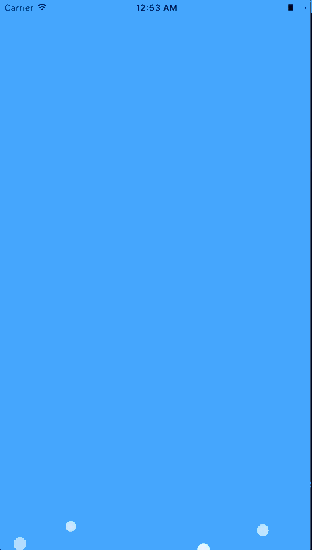
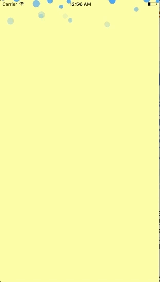

# WaterDrops
Simple water drops animation 💧

  

## Example
```swift
override func viewDidLoad() {
     super.viewDidLoad()
     
         self.view.backgroundColor = UIColor.white
 
         // custom configuration
         let waterDropsView = WaterDropsView(frame: self.view.frame,
                                           direction: .up,
                                           dropNum: 10,
                                           color: UIColor.red.withAlphaComponent(0.7),
                                           minDropSize: 10,
                                           maxDropSize: 20,
                                           minLength: 50,
                                           maxLength: 100,
                                           minDuration: 4,
                                           maxDuration: 8)
         
         // add animation 
         waterDropsView.addAnimation()
         self.view.addSubview(waterDropsView)
}
```

## Installation

### Cocoapods
```ruby
pod "WaterDrops"
```

## Author

LeFal, qwertyhj2@gmail.com

## License

'WaterDrops' is available under the MIT license. See the LICENSE file for more info.
